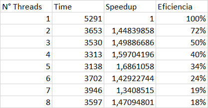
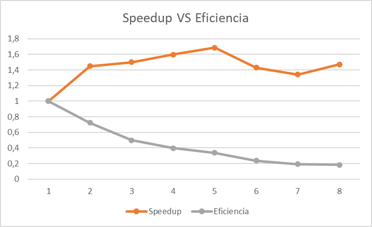

# Parallel Primes

This project creates a program that gives the prime numbers between two numbers, with the use of parallel programming 
and processor cores. It also expects to know the speedup and efficiency of the code.

